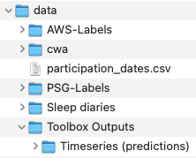
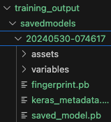

# Sleep-Wake Detection

This project develops a deep learning model to classify AX3 activity data, recorded by digital activity trackers, into periods of sleep and wake.

# Environemnt

Create a conda environment and install the requirements:

    conda install --file requirements.txt

# Data

Create a folder names `data` in project root (e.g. Sleep-Wake/data). All data will be read from and written back to this folder.

Create the following subfolders and place the corresponding data files in each one:

- `cwa`: Raw AX3 (.cwa) files.
    - Sample file name: `SDRI001_AX3_ALL_001V2-V4_D-9D-8D-7D-6D-5D-4D-3D-2D-1D1.cwa`
- `AWS-Labels`: AWS label files.
    - Sample file name: `mesa-sleep-0001_Date_time.csv`
- `PSG-Labels`: PSG label files:
    - Sample file name: `SDRI001_PSG_Sleep profile_001V4_N1.txt`
- `Sleep diaries`: Sleep diary xlsx files.
    - File 1: `SRC_DRI_001_SleepDiary_All_v5.0_20JAN2021.xlsx`
    - File 2: `SRCDRI001_Sleep Diary 019-036 DB.xlsx`
- `Toolbox Outputs/Timeseries (predictions)` (Note two nested folders): Biobank output

There is one additional file containing the timestamps of when a participants recordings start and end. This is called `participation_dates.csv` and needs to be placed in the `data` folder (no subfolder needed).

Your data folder should now look like this:

# Running The Code

## 1. Data Preparation

1. Run `cwa_to_parquet.py`

    This script reads the `cwa` raw files (AX3 recordings) and converts them to Parquet.
    The `actipy` package will also do some processing (like gravity calibration) during this step.
    
    You only need to run this script once to produce the Parquet files.
    
2. Run `parquet_to_tfrecords.py`

    This script reads the Parquet files produced in the previous step and turns them into TFRecords (A format suitable for Tensorflow).

    You need to set the `WINDOW_SIZE` parameter at the top of this script. This must be an odd number. This determines how many epochs are bundled together as a single data point.

    This file reads both AX3 recordings and PSG labels and joins the two. Those eopchs that are present in PSG labels files (lab-day epochs) are called `labelled`. All other epochs are called `unlabelled`.

    There is a dict at the beginning of the script where you can choose which dataset you want the script to produce.

        write_flag = {
            LABELLED: True,
            UNLABELLED: False
        }

    You can set one or both to `TRUE` to enable writing the corresponding dataset. Writing the `labelled` dataset is relatively fast because it's small. Writing the `unlabelled` files takes more time.

    The `labelled` files are used for training the model. The `unlabelled` dataset is our test dataset (Days other than lab-day).

At this end of this process you will have two new folders inside the `data` folder: `Parquet` and `Tensorflow`.

If you need data with a new window size, you don't need to do the first step. As long as you have the Paruqet files (created in step 1) you can skip that step and just run step 2 with a new `WINDOW_SIZE` parameter.

## 2. Training

### Config File
Some model parameters are set in the `project_config` dictionary in `config.py`. The ones most relevant to training are `window_size` and `n_cv_folds`.

The `window_size` parameter tells the training script which data folder to use, which in turn determines the window size of the data and the model trained.

The `n_cv_folds` is the number of folds using for K-fold cross validation.

### The Model

The model itself is in `models.py`. You can create new models here, import them into `train.py` and use the same `train_model` function to train and experiment with them.

There are three different methods for building a model in Keras: 1) Sequential 2) Functional 3) Sub-classing. We're taking the third approach in `models.py`, which is the most flexible (but needs a little more coding). See [this article](https://medium.com/thedeephub/sequential-vs-functional-vs-subclassing-api-in-tensorflow-8bfcfe91859d) for details.

A sub-classed model has at least two main components:

1) An `__init__` function, in which you craete all the layers the model is going to use, e.g. perhaps a few dense layers, a few convolutional layers, etc.
2) A `call` function where you use all these layers to describe the computation the model wants to do with its input.

If you need to create a new model, it doesn't have to be sub-classed. You can take a simple approach, like the functional api, and it will work fine with `train.py`.

### Training
Model training is done in `train.py`. This file can run in two modes: cross validation and training a single model. This is determined by the `training_mode` flag and can be set at the top of the main body of the script.

The main function in charge of instantiating and training the model is called `train_mdoel`.

Note about validation: Our validation set is a random subset of epochs chosen based on their epoch id. The vaalidation dataset is created as follows (this is inside the `train_model` function):

    val_data = create_dataset(
    datapath,
    filters=[
        partial(keep_subjects, subject_ids=train_val_ids),
        lambda x, y: x['central_epoch_id'] % 8 == 0
        ],
    batch_size=100
    )

Notice the second filter: `lambda x, y: x['central_epoch_id'] % 8 == 0`. This means one out of every 8 epochs (12.5%) should be set aside for validation. For example if we set aside subjects 1 to 5 as the test fold, we will be training on subjects 6 to 36, while reserving 1 out of 8 of their epochs for validation (And not 1 to 5, as they are test subjects, not validation).

### Training Outputs

The training process produces a few outputs. The path where these are stored is determined by the `output_dir` variable in `train.py`.

Each time you run `train.py` it creates (and prints) a timestamp. This is used to identify that particular run and avoid overwriting the outputs of the previous run. The timestamp looks something like `20240608-202026` and consists of current date and time. The outputs generated by each run are saved under folders named using this timestamp.

- Tensorboard logs: saved in `tb_logs` subfolder of `[output_dir]`. To see open Tensorboard you need to run tensorboard from the terminal (where the Conda environment is activated):

    > tensorboard --logidr [path-to-tensorboard-logs]

    For example, run this from project root (e.g. Sleep-Wake folder):

    > tensorboard --logdir training_output/tb_logs

- Saved Models: During training Tensorflow saves the best model so far in this folder under a subfoldee named using the timestamp of the current run. This saved model can later be used to produce predictions on unlabelled data. Current default path is `[output_dir]/savedmodels`. A saved model folder looks like this:

    

- CV predictions: If `training_mode` is set to CV, at the end of each fold the script will generate predictions on test subjects using the model trained on the rest of the subejcts and save them under the folder specified by teh `cv_preds_path` variable. The current default is `Results/Predictions/CV/[timestamp]`.

## 3. Making Predictions

If you need to make predictions on unseen data, it's best to train a single model on all labelled data (rather than CV) and use that model for prediction.

The training script by default saves this under `training_output/savedmodels/[timestamp]`. Once you're happy with a model and want to use it for prediction, it's best to move it to another folder, as this folder can quickly get crowded by subsequent runs of training.

Let's say you copied your saved model into a folder named `Model Repo`. You can rename the folder to a more memorable name, e.g. `Attn-CNN-2`.

You can now use `predict.py` to make predictions on unlabelled data. You may need to go back to data preparation and write unlabelled AX3 data using `parquet_to_tfrecords.py` first.

Once your unlabelled data is ready, set `model_name` variable in `predict.py` to the name of the folder where your saved model is. Set the other input and output paths and run the script. The output (epoch-by-epoch predictinos) will be saved in csv files in the path specified by `pred_output_path`.

## 4. Preparing the results for plotting, metric calculation, etc.

Now that we have the predictions of our model, we need to bring in data from other sources so we can compare, plot and calculate metrics.

This is done by the `merge_sources.py` script. This reads data from multiple sources (AWS, PSG, Biobank, etc.), combines them with our predictions and saves the result in a new set of csv files, given by `output_path` variable. The current default is `Results/merged_indicators`.

These are the files used to make raster plots and to calculate metrics.

## 5. Calculating Metrics

Metrics are caluclated in the `metrics.ipynb` notebook. The first section calculates EBE metrics while the second section produces sleep summary metrics.

## 6. Raster Plots

The `sleep_wake_plots.ipynb` notebook produces raster plots. This works fine now, but may be a little difficult to make changes to.
